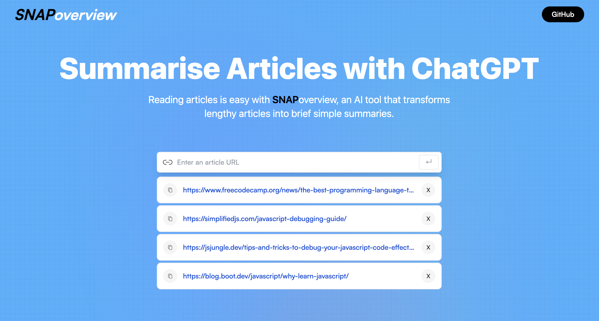

# snapOverview

> snapOverview - An easy to use AI article summariser.

### Table of Contents

- [Description](#description)
- [Author Info](#author-info)

## Description

snapOverview allows users to quickly summarise long form articles into concise and easy to read summaries, allowing the user to find out whether reading the entire article is going to be worth their time and effort.

[Back To The Top](#snapoverview)

---

#### Technologies

- HTML5
- CSS3
- JavaScript
- React

[Back To The Top](#snapoverview)

---

## Author Info

- Website - [Brandon Guard](https://www.brandon-guard.com)

[Back To The Top](#snapoverview)
